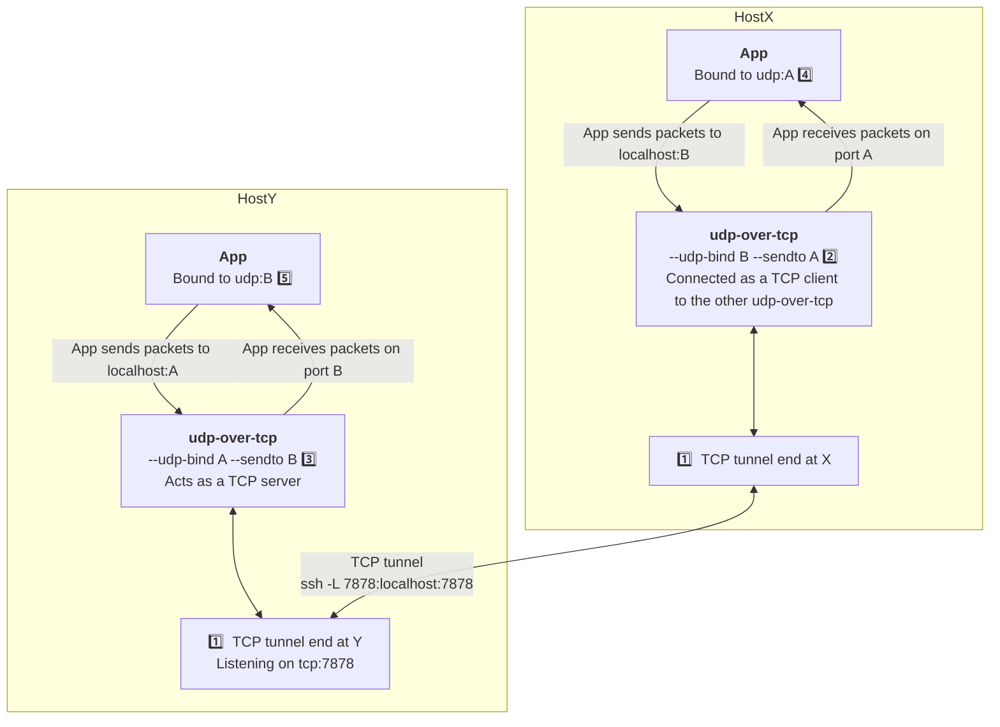

# udp-over-tcp

A command-line tool for forwarding UDP datagrams over TCP.

It is particularly useful for [tunneling UDP over SSH][so].

Unlike solutions relying on `nc` or `socat` it will preserve UDP
datagram boundaries.

Unlike [mullvad's udp-over-tcp][mullvad], it supports bi-directional
proxying so that UDP responses also end up in the right place (which
can't to my knowledge be done even with multiple invocations of their
`udp-over-tcp`).

The program [comes pre-compiled][rel] for a number of platforms (thanks
[cargo-dist]!), and should be executable out of the box with no
dependencies.

[so]: https://superuser.com/questions/53103/udp-traffic-through-ssh-tunnel/
[mullvad]: https://github.com/mullvad/udp-over-tcp
[rel]: https://github.com/jonhoo/udp-over-tcp/releases
[cargo-dist]: https://opensource.axo.dev/cargo-dist/

## Usage

You have a UDP application on host X, bound to port A.
You want it to talk to a UDP application running on host Y on port B.

Great, do as follows:

On either host (here X), first create a TCP tunnel to the other host:

    X $ ssh -L 7878:127.0.0.1:7878 $Y  # 1️⃣

Next, run udp-over-tcp on both hosts, one with `--tcp-listen` and one with `--tcp-connect`.
The `--tcp-listen` should be used on the host that the forwarding allows connecting _to_ (here Y).
You can run them in either order, but best practice is to listen first:

    Y $ udp-over-tcp --tcp-listen  7878 --udp-bind $A --udp-sendto $B  # 2️⃣
    X $ udp-over-tcp --tcp-connect 7878 --udp-bind $B --udp-sendto $A  # 3️⃣

On Y, this will listen on UDP port `$A`, forward those over TCP (the SSH tunnel will thus tunnel them to X), and then deliver them to UDP port `$A` there. \
On X, this will listen on UDP port `$B`, forward those over TCP (tunnelled to Y), and then deliver them to UDP port `$B` there.

Now configure the application on X to send to 127.0.0.1:$B (4️⃣) 
and configure the application on Y to send to 127.0.0.1:$A (5️⃣).
In other words, same port, local IP address.

Each argument takes a port number (as above) or addr:port to specify the address.
(address defaults to 0.0.0.0 for listen/bind and 127.0.0.1 for connect/sendto)

## License

Licensed under either of

 * Apache License, Version 2.0
   ([LICENSE-APACHE](LICENSE-APACHE) or http://www.apache.org/licenses/LICENSE-2.0)
 * MIT license
   ([LICENSE-MIT](LICENSE-MIT) or http://opensource.org/licenses/MIT)

at your option.

## Contribution

Unless you explicitly state otherwise, any contribution intentionally submitted
for inclusion in the work by you, as defined in the Apache-2.0 license, shall be
dual licensed as above, without any additional terms or conditions.
